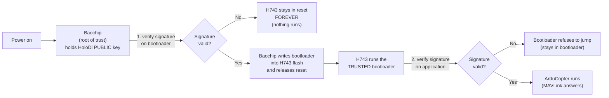
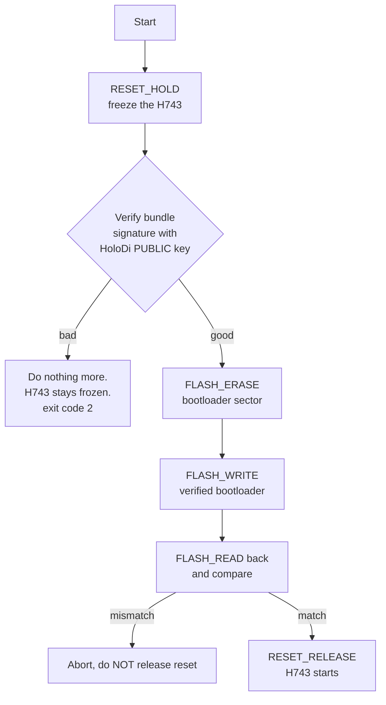
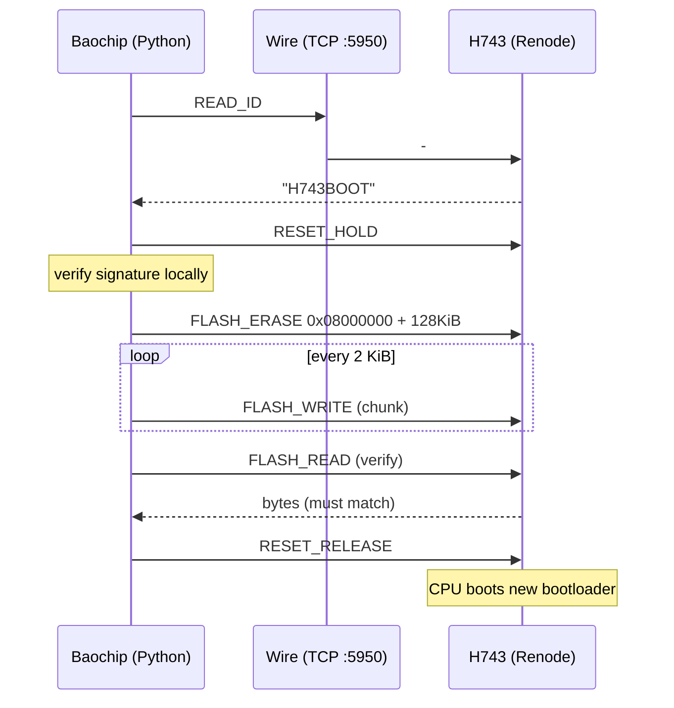
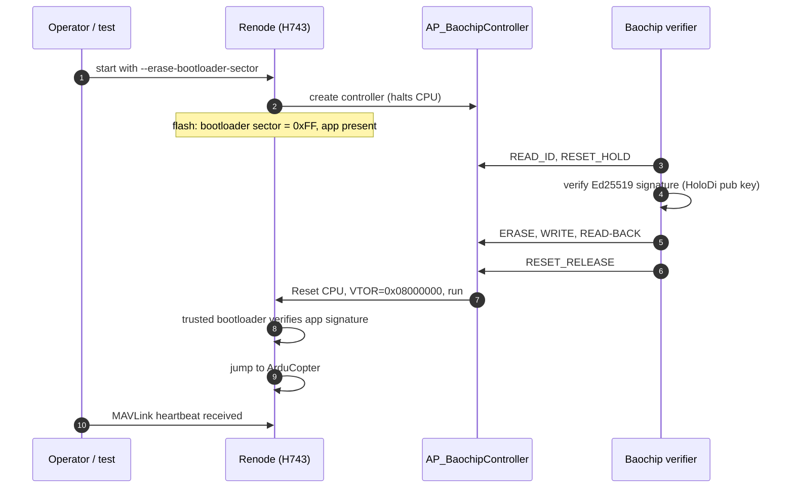

# Baochip → H743 Secure Boot: What I Built, Why, and How

This document explains, in plain English, everything that was added to implement
`requirements.md`.

**Diagrams.** Each section has a **Mermaid** block (renders on [GitHub](https://github.com)
and in VS Code/Cursor if you install **Markdown Preview Mermaid Support** and open
**Markdown: Open Preview**). If you only see gray code fences, use the **Plain
view** ASCII block directly under each diagram.

---

## 1. The 30-second version

**Problem.** A drone flight controller (the STM32 **H743**) runs a bootloader and
then the flight software (**ArduCopter**). If an attacker swaps either one for a
fake, the drone is compromised.

**Idea.** Don't let the H743 trust itself. Put a second small chip, the
**Baochip**, in charge. Baochip is the *root of trust*:

1. Baochip holds the H743 in reset (the H743 cannot run anything).
2. Baochip checks a digital signature on the H743's bootloader.
3. Only if the signature is good, Baochip writes that bootloader into the H743's
   flash and lets the H743 start.
4. The (now trusted) bootloader checks a signature on the flight software.
5. Only if that is good does the flight software run.

**What exists now.** A working simulation of this whole chain. The H743 runs in
**Renode**. Baochip's job is played by a Python program that talks to the H743
through a "wire" that mimics SPI + a reset pin. A test runs four scenarios and all
four behave correctly.

**Important honesty note.** The real Baochip Verilator simulation is **not** in
this loop yet (see section 11). The "Baochip" in the tests is a Python stand-in
that is written to be ported to the real chip later.

---

## 2. The big picture: the chain of trust



Plain view (chain of trust):

```text
Power on
   |
   v
Baochip (HoloDi PUBLIC key) --verify bootloader signature-->
   |                              |
   | invalid                      | valid
   v                              v
H743 in reset FOREVER      write bootloader to H743 flash, release reset
                                   |
                                   v
                           H743 runs TRUSTED bootloader --verify app-->
                                   |                    |
                                   | invalid            | valid
                                   v                    v
                           stay in bootloader      ArduCopter (MAVLink)
```

Trust flows in one direction. Each stage only starts the next stage after checking
it:

```
Baochip  ──trusts──▶  H743 bootloader  ──trusts──▶  ArduCopter application
 (has key)             (has same key)                (signed with private key)
```

---

## 3. Who is who (cast of characters)

| Name | What it is | Where it lives |
|---|---|---|
| **HoloDi key pair** | Ed25519 signing keys. Private key signs; public key verifies. | `holodi/keys/` |
| **Baochip** | Root of trust. Simulated by a Python program (and, separately, Verilator model not yet wired in). | `holodi/baochip_verifier.py` |
| **H743** | The flight controller MCU (Kakute H7 board), emulated in Renode. | `ardupilot/Tools/renode/…` |
| **H743 bootloader** | ArduPilot bootloader built with the HoloDi public key baked in. | `holodi/build/KakuteH7_bl.bin` |
| **Application** | ArduCopter, signed with the HoloDi private key. | `holodi/build/arducopter-holodi-signed.apj` |
| **The "wire"** | A TCP connection standing in for SPI + reset pin. | port `5950` |

### Files I added or changed

| File | New / changed | One-line purpose |
|---|---|---|
| `holodi/boot_bundle.py` | new | Pack + sign + verify + tamper the bootloader "bundle" |
| `holodi/baochip_verifier.py` | new | The Baochip firmware stand-in |
| `ardupilot/Tools/renode/peripherals/common/AP_BaochipController.cs` | new | Renode side of the wire; controls H743 reset and flash |
| `ardupilot/Tools/renode/run.py` | changed (+15 lines) | New `--erase-bootloader-sector` flag |
| `sim/run_secure_boot.sh` | new | One-command interactive demo |
| `holodi/req_full_chain.py` | new | Automated 4-scenario test |

### Files that already existed and I did **not** change

- `holodi/req1_secure_boot.py`: the earlier test that proves the *bootloader → app*
  link (requirements 4–5).
- `sim/build_secure.sh` + `sim/Dockerfile`: build the HoloDi-keyed bootloader and
  signed ArduCopter.
- `ardupilot/libraries/AP_CheckFirmware/AP_CheckFirmware.cpp`: the actual code
  inside the bootloader that verifies the application signature.
- `sim/run_dabao.sh`: boots the Baochip (Dabao) in Verilator. Still separate.

---

## 4. Part by part: What, Why, How

### 4.1 Signing keys (already existed)

**What.** A pair of Ed25519 keys made with Monocypher.
`holodi/keys/holodi_private_key.dat` and `holodi_public_key.dat`.

**Why.** Digital signatures let a chip check "this file was produced by someone
holding the private key" while only knowing the *public* key. The public key is
safe to put inside devices. The private key stays with the signer (it is
git-ignored: `holodi/keys/*private*`).

**How.** The key file format is `PUBLIC_KEYV1:<base64>` / `PRIVATE_KEYV1:<base64>`.
`sim/build_secure.sh` builds the H743 bootloader with the public key baked in:

```bash
Tools/scripts/build_bootloaders.py KakuteH7 \
    --signing-key=/work/holodi/keys/holodi_public_key.dat --omit-ardupilot-keys
```

`--omit-ardupilot-keys` matters: it removes ArduPilot's own official keys, so only
HoloDi-signed firmware is accepted.

---

### 4.2 The boot bundle: `holodi/boot_bundle.py`

**What.** A small file format that packages the H743 bootloader with its signature:

```
+----------+----------------+------------------+---------------------+
| "BAOBOOT1"| length (4 B)   | signature (64 B) | bootloader bytes    |
+----------+----------------+------------------+---------------------+
```

**Why.** Baochip needs one self-contained thing to check: "here are the bytes I
will install, and here is proof they are authorized". On real hardware this bundle
would live in Baochip's own flash.

**How.** Signing and checking are two lines each:

```python
sig = monocypher.signature_sign(private_key, bootloader_bytes)        # sign
ok  = monocypher.signature_check(signature, public_key, bootloader)   # verify
```

It also has a `tamper()` helper that flips **one bit** of the bootloader without
touching the signature. That is how we simulate an attacker.

Command-line use:

```bash
.venv/bin/python holodi/boot_bundle.py sign   holodi/build/KakuteH7_bl.bin holodi/build/bootloader.bundle
.venv/bin/python holodi/boot_bundle.py verify holodi/build/bootloader.bundle     # prints OK
.venv/bin/python holodi/boot_bundle.py tamper holodi/build/bootloader.bundle holodi/build/bad.bundle
.venv/bin/python holodi/boot_bundle.py verify holodi/build/bad.bundle            # prints BAD
```

> Gotcha I hit: in this Monocypher version `signature_check` **returns
> True/False**, it does not raise an exception. My first version treated "no
> exception" as "good" and accepted a tampered bundle. Fixed and re-tested.

---

### 4.3 The Baochip stand-in: `holodi/baochip_verifier.py`

**What.** A Python program that does exactly what the Baochip firmware must do.

**Why.** This is the heart of requirements 1–3 and 6: Baochip decides whether the
H743 may run.

**How.** The sequence is fixed and the order matters:



Plain view (Baochip verifier):

```text
Start -> RESET_HOLD (freeze H743)
      -> verify bundle signature (HoloDi public key)
            | bad  -> H743 stays frozen, exit 2
            | good -> FLASH_ERASE bootloader sector
                   -> FLASH_WRITE verified bootloader
                   -> FLASH_READ back and compare
                         | mismatch -> abort, keep reset held
                         | match    -> RESET_RELEASE, H743 boots
```

The decision point in code:

```python
wire.reset_hold()
if not boot_bundle.verify(bundle, public_key):
    _log("REFUSED: bootloader signature INVALID. H743 will be held in reset.")
    ...
    return 2          # never calls reset_release()
```

Key design choice: **the only way the H743 ever starts is the `reset_release()`
call at the very bottom**, which is only reachable after a successful verify and a
successful read-back.

`--no-hold` makes it exit right after a refusal (handy for tests). Without it, the
program sits forever, like real hardware that never lets go of the reset pin.

---

### 4.4 The wire (protocol)

**What.** A tiny command language between Baochip and the H743 side.

**Why.** On real hardware Baochip talks to the H743 over **SPI** (clock, MOSI,
MISO, chip-select) and controls the H743's **NRST** pin. Two separate simulators
(Renode and Verilator/Python) can't share real pins, so I represent "one
chip-select pulse" as "one TCP message". This keeps the *protocol* identical to
what you will clock out on real pins later.

**How.** Each request/reply is length-prefixed:

```
Request:  [len: 2 bytes big-endian] [opcode] [payload...]
Reply:    [len: 2 bytes big-endian] [status 0=ok] [data...]
```

| Opcode | Name | Payload | What it does |
|---|---|---|---|
| `0x9F` | READ_ID | none | Returns `"H743BOOT"` (are we connected to the right thing?) |
| `0xE4` | FLASH_ERASE | addr(4) len(4) | Fill range with `0xFF` |
| `0x02` | FLASH_WRITE | addr(4) len(2) data | Write bytes into H743 flash |
| `0x03` | FLASH_READ | addr(4) len(2) | Read bytes back |
| `0xB1` | RESET_HOLD | none | Freeze the CPU (NRST asserted) |
| `0xB0` | RESET_RELEASE | none | Reset the CPU and let it run |



Plain view (wire protocol order):

```text
Baochip          Wire (TCP :5950)          H743 (Renode)
   |-- READ_ID --------------------------->|
   |<------------- "H743BOOT" -------------|
   |-- RESET_HOLD ------------------------>|
   |  (verify signature locally on Baochip) |
   |-- FLASH_ERASE (128 KiB @ 0x08000000) ->|
   |-- FLASH_WRITE (2 KiB chunks) --------->|  (repeat)
   |-- FLASH_READ (read-back check) ------->|
   |<------------- bytes -------------------|
   |-- RESET_RELEASE --------------------->|  CPU runs new bootloader
```

---

### 4.5 The Renode side: `AP_BaochipController.cs`

**What.** A custom Renode peripheral (written in C#). It is the H743's end of the
wire.

**Why.** Renode doesn't know anything about Baochip. This peripheral gives the
outside world a controlled way to (a) freeze/unfreeze the CPU and (b) program
flash, which is what an external root-of-trust chip would do to a real MCU.

**How.** Key behaviours:

1. **Freezes the CPU as soon as it is created.**
   ```csharp
   // Halt the CPU as early as possible: the H743 must not execute
   // from the (erased) bootloader sector before Baochip programs it.
   HoldCpu();
   ```
2. **Limits what Baochip can touch** to H743 flash only
   (`0x08000000`–`0x08200000`), so a bad command can't scribble over peripherals.
3. **RESET_RELEASE does a real reset, then fixes the vector table.** This was a
   bug I hit: `cpu.Reset()` sets the vector-table pointer (VTOR) to 0, so the CPU
   started at address 0 and never booted. The fix re-points it at the bootloader:
   ```csharp
   cpu.Reset();
   RestoreVectorTable(cpu);   // VectorTableOffset = 0x08000000
   cpu.IsHalted = false;
   ```
   Doing a *reset* (instead of just un-halting) matters: a Cortex-M reads its
   starting stack pointer and program counter from the vector table **at reset
   time**. Without a reset, it would never see the bootloader that Baochip just
   wrote.

---

### 4.6 The `run.py` patch: `--erase-bootloader-sector`

**What.** A new option for ArduPilot's Renode launcher
(`ardupilot/Tools/renode/run.py`).

**Why.** Requirement 3 says the H743 must not be able to bypass a failed
verification. If the genuine bootloader were already sitting in the H743's flash at
power-on, a refused Baochip would be meaningless: the H743 could just run it.
So at power-on the bootloader sector must be **empty**.

**How.** The launcher still loads the bootloader (so it knows where the vector
table lives) and then overwrites that sector with `0xFF`:

```python
if args.erase_bootloader_sector:
    with open(flash_img, 'r+b') as flash:
        flash.seek(bootloader_offset)
        flash.write(b'\xff' * bootloader_size)
```

An erased vector table points at address `0xFFFFFFFF`, which does not exist, so
even if the CPU did run, it would fault immediately.

---

### 4.7 One-command demo: `sim/run_secure_boot.sh`

**What.** A shell script that starts Renode and the Baochip stand-in together.

**Why.** For showing the system to someone interactively.

**How.** It (1) builds the signed bundle if missing, (2) starts Renode with the
controller attached, (3) waits for port 5950, (4) runs the verifier, (5) leaves
Renode running so you can connect over MAVLink on `tcp:localhost:5762`.

The one tricky line attaches the controller to Renode:

```bash
--exec "include @$CTRL_CS" \
--exec "machine LoadPlatformDescriptionFromString \"baochipCtrl: Miscellaneous.AP_BaochipController @ none { port: $BAO_PORT }\""
```

---

### 4.8 The automated test: `holodi/req_full_chain.py`

**What.** Runs four boots back-to-back and decides pass/fail for each.

**Why.** To prove each link of the chain actually does its job, including the
"attacker" cases. A security design that is only tested on the happy path is
unproven.

**How.** For each case it launches a fresh Renode, runs the verifier, then
observes three things: the **verifier's exit code**, whether a **MAVLink
heartbeat** appears, and the CPU's **program counter** (read via Renode's monitor).

```mermaid
flowchart TD
    subgraph "Case 1: genuine"
      a1["Good bootloader bundle"] --> a2["Baochip releases H743"] --> a3["Good app"] --> a4["ArduCopter runs<br/>heartbeat = yes"]
    end
    subgraph "Case 2: tampered-boot"
      b1["1 bit flipped in bootloader"] --> b2["Baochip REFUSES<br/>rc=2, PC=0x0"]
    end
    subgraph "Case 3: tampered-app"
      c1["Good bootloader"] --> c2["Baochip releases"] --> c3["App changed after signing"] --> c4["Bootloader REFUSES<br/>PC stays in bootloader"]
    end
    subgraph "Case 4: unsigned-app"
      d1["Good bootloader"] --> d2["Baochip releases"] --> d3["Official ArduCopter<br/>(not HoloDi-signed)"] --> d4["Bootloader REFUSES<br/>PC stays in bootloader"]
    end
```



Plain view (four test cases):

```text
Case 1 genuine:       good bundle -> Baochip OK -> good app -> ArduCopter + MAVLink
Case 2 tampered boot: 1 bit flip in bootloader -> Baochip REFUSES (rc=2, PC=0)
Case 3 tampered app:  good boot path -> app changed after sign -> bootloader REFUSES
Case 4 unsigned app:  good boot path -> official (unsigned) app -> bootloader REFUSES
```

Result of the last full run:

| Case | verifier rc | MAVLink | PC | Meaning | Result |
|---|---|---|---|---|---|
| genuine | 0 | yes | `0x081455e8` (app) | Everything trusted, app runs | PASS |
| tampered-boot | 2 | no | `0x00000000` | Baochip refused; H743 never started | PASS |
| tampered-app | 0 | no | `0x08006698` (bootloader) | Bootloader refused the app | PASS |
| unsigned-app | 0 | no | `0x08006698` (bootloader) | Bootloader refused the app | PASS |

How to read the PC: bootloader code lives at `0x08000000`–`0x0801FFFF`; the app
lives at `0x08020000` and above. So a PC in the bootloader range with no heartbeat
means "bootloader is alive but would not jump".

---

## 5. Full boot timeline (genuine case)



Plain view (genuine boot timeline):

```text
1. Start Renode with --erase-bootloader-sector (boot sector = 0xFF, app on disk)
2. Controller created -> CPU halted
3. Baochip: READ_ID, RESET_HOLD
4. Baochip verifies Ed25519 on bootloader bundle
5. Baochip: ERASE, WRITE, READ-BACK over wire
6. Baochip: RESET_RELEASE -> CPU reset, VTOR=0x08000000
7. Bootloader verifies signed app -> jump to ArduCopter
8. Operator sees MAVLink heartbeat
```

---

## 6. Simulation vs. real hardware

| Piece | In this simulation | On real hardware (later) |
|---|---|---|
| Baochip logic | Python (`baochip_verifier.py`) | Rust task on Xous running on the Baochip |
| SPI link | TCP socket, one frame = one chip-select pulse | SCLK / MOSI / MISO / CS pins |
| H743 reset control | `cpu.IsHalted` + `cpu.Reset()` in Renode | Baochip GPIO wired to the H743 NRST pin |
| Writing H743 flash | `sysbus.WriteBytes` backdoor | A real flash-programming path (e.g. ST system bootloader over SPI, or SWD) |
| Public key storage | A file read by Python | Protected, write-locked region of Baochip memory |
| Signature check | Monocypher Ed25519 (Python binding) | Monocypher/other Ed25519 in Rust, or Baochip's crypto hardware |

The **order of operations and the message set are the same**; that is the part
meant to carry over.

---

## 7. Requirements coverage (honest version)

| # | Requirement | Status | Notes |
|---|---|---|---|
| 1 | Baochip has a trusted root of key | **Partial** | Key is a file read by the stand-in. Real tamper-proof storage is a hardware task. |
| 2 | Bootloader signed; Baochip verifies | **Done (sim)** | Ed25519 signature verified before install. |
| 3 | H743 cannot bypass a failed check | **Done (sim)** | Sector erased at power-on, CPU frozen. On real hardware this additionally needs NRST physically driven by Baochip and flash protection on the H743 (e.g. read/write protection) so it cannot rewrite its own bootloader. |
| 4 | Trusted bootloader verifies the app | **Done** | Existing ArduPilot logic, tested by the earlier script and my cases 3 and 4. |
| 5 | App must be signed; reject modified/unauthorized/wrong-target | **Done** | Signature + CRC + board-ID checks in `AP_CheckFirmware.cpp`. Wrong board ID not separately tested. |
| 6 | Explicit chain of trust | **Done** | Each refusal is visible at a different layer. |
| 7 | Defined failure behavior | **Done (sim)** | Layer 1: stay in reset. Layer 2: stay in bootloader. |
| 8 | Key provisioning, update, rotation, revocation | **Not designed or implemented** | See section 9. |

---

## 8. Problems I ran into (and how they were fixed)

1. **Tampered bundle passed verification.** `signature_check` returns a boolean;
   I was waiting for an exception. Fixed in `boot_bundle.verify()`.
2. **H743 never booted after release (PC = 0).** `cpu.Reset()` clears the
   vector-table pointer. Fixed by restoring `VectorTableOffset` after reset.
3. **A stale Renode gave a possible false pass.** `run.py` starts Renode in its own
   process group, so killing `run.py` left Renode alive, still listening on the same
   ports. The next test's verifier could talk to the *old* Renode. Fixed by
   killing by unique state-directory name (same trick `req1_secure_boot.py` uses),
   and by waiting for ports to free up before each case. Only after this fix did
   `tampered-boot` show the correct `PC=0x0`.
4. **Race at start-up.** Renode's `--exec` commands run *after* `start`, so the
   CPU could run briefly before the controller halts it. The `--erase-bootloader-sector`
   change makes this harmless: there is nothing valid to run.

---

## 9. Known gaps / what is *not* done

- **Verilator Baochip is not in the loop.** `sim/run_dabao.sh` boots Xous on the
  Baochip model, but it is not connected to the wire. The Baochip logic here is
  Python on your host.
- **The wire is TCP, not pin-accurate SPI.** There are no clock edges or MISO/MOSI
  timing. Real SPI wiring will need either a Verilator pin-level shim or the real
  hardware.
- **Key management (requirement 8) is not designed.** Today there is exactly one
  key pair (HoloDi) used for **both** layers (bootloader and app). Missing:
  - separate keys per layer (so an app-signing key leak cannot forge bootloaders),
  - a way to add/rotate keys (ArduPilot's bootloader supports multiple public keys
    via its secure-command mechanism, which could be explored),
  - revocation (e.g. a minimum version counter or a revoked-key list on Baochip),
  - rollback protection (an old, validly signed, vulnerable bootloader is still
    accepted today).
- **Flash write is a simulation backdoor.** Real hardware needs a real
  programming path and H743 flash protection.
- **No test for wrong-board firmware** (requirement 5's "incorrectly targeted").
- **No timing/anti-glitch considerations**, and the stand-in is not hardened.

---

## 10. How to demonstrate this to someone

### 10.1 Before you start

Everything is already built (`holodi/build/` has the bootloader and signed app).
If you need to rebuild: `sim/build_secure.sh` (needs Docker).

Make sure no old Renode is running (otherwise ports clash):

```bash
lsof -i :5762 -i :5950 -i :1234     # should print nothing
# if it prints something:  pkill -9 -f renode
```

### 10.2 Demo A: "the happy path" (about 1 minute)

```bash
sim/run_secure_boot.sh
```

Talk track and what to point out in the output:

1. `[BAOCHIP] verifying bootloader signature against HoloDi public key...`
2. `[BAOCHIP] signature OK` → "Baochip decided this bootloader is authentic."
3. `erasing … writing … read-back matches` → "Baochip installed it itself."
4. `releasing H743 from reset` → "Only now does the flight controller start."

Then, in a second terminal, prove the flight software is alive:

```bash
.venv/bin/python -c "
from pymavlink import mavutil
c = mavutil.mavlink_connection('tcp:localhost:5762', source_system=255)
print('heartbeat:', bool(c.wait_heartbeat(timeout=60)))"
```

Stop with Ctrl-C and `pkill -9 -f renode`.

### 10.3 Demo B: "attacker modifies the bootloader" (about 30 seconds)

```bash
.venv/bin/python holodi/boot_bundle.py tamper \
    holodi/build/bootloader.bundle holodi/build/evil.bundle
BUNDLE=holodi/build/evil.bundle sim/run_secure_boot.sh
```

Expected: `REFUSED: bootloader signature INVALID. H743 will be held in reset.`
and no heartbeat on port 5762. Point out that *one flipped bit* was enough.
(Note: the demo script's verifier is started with `--no-hold`, so it exits
after refusing; Renode keeps the H743 frozen.)

### 10.4 Demo C: "attacker modifies the application" (the second layer)

Run the automated case, which uses a tampered ArduCopter:

```bash
.venv/bin/python holodi/req_full_chain.py --only tampered-app
```

Expected: `verifier_rc=0` (Baochip trusted the bootloader), `heartbeat=no`,
and `PC` inside `0x0800xxxx` meaning "bootloader is running but refuses to jump".
Contrast with Demo B: *different layer, different symptom.*

### 10.5 Demo D: the whole thing at once (about 5 minutes)

```bash
.venv/bin/python holodi/req_full_chain.py
```

Expect four `PASS` lines and `Full chain: PASS`.

### 10.6 Optional "poke the wire by hand"

While Renode is running (Demo A, before the verifier connects, or in a test):

```python
import socket, struct
s = socket.create_connection(("127.0.0.1", 5950))
s.sendall(struct.pack(">H", 1) + bytes([0x9F]))      # READ_ID
print(s.recv(64))
```

This shows that Baochip's whole interface to the H743 is a handful of simple,
auditable commands, which is exactly what you will implement over SPI.

### 10.7 Suggested explanation order for an audience

1. Show the chain-of-trust diagram (section 2).
2. Run Demo A (good path).
3. Run Demo B (bad bootloader, Baochip stops it).
4. Run Demo C (bad app, bootloader stops it).
5. Show the "simulation vs hardware" table (section 6) and be upfront about the gaps
   (section 9), especially key rotation/revocation.

---

## 11. Suggested next steps

1. **Wire in the real Baochip.** Add Rust code to the Xous image that performs the
   same sequence, and expose real SPI/GPIO pins from the Verilator model with a
   small C++ shim that forwards them to Renode.
2. **Design key management** (requirement 8): separate bootloader-signing and
   app-signing keys, a version counter for rollback protection, and a revocation
   plan.
3. **Harden the H743 side:** flash write protection so only Baochip's programming
   path can change the bootloader.
4. **Add tests:** wrong-board-ID firmware, truncated images, rollback to an old
   signed bootloader.
